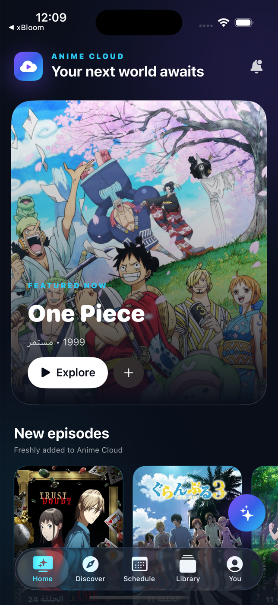
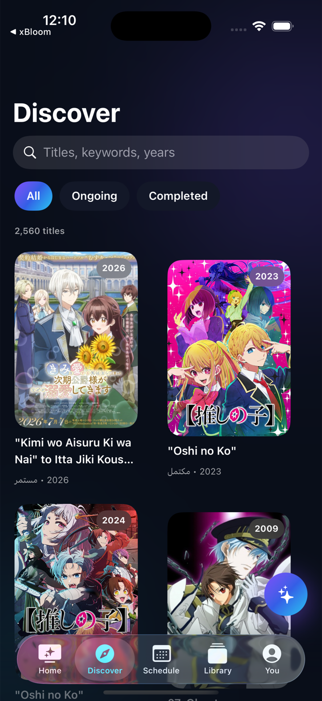
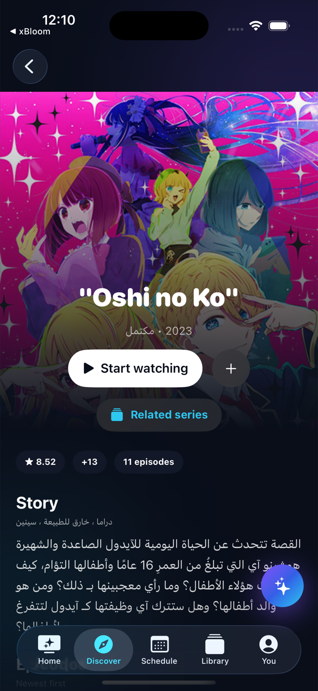
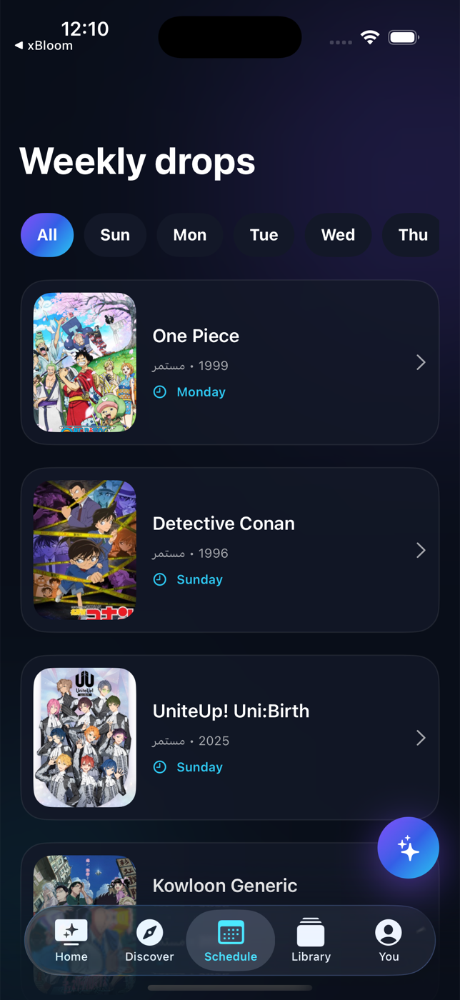

# AnimeCloud

A native SwiftUI client for discovering, tracking, and watching anime from the Anime Cloud catalog on iPhone and iPad.

[](https://developer.apple.com/ios/)
[](https://www.swift.org/)
[](https://github.com/Lui35/AnimeCloud/actions/workflows/main-ci.yml)
[](https://github.com/Lui35/AnimeCloud/releases/latest)

## Screenshots

<p align="center">
  
  
  
  
</p>

## Highlights

- Live home, discovery, weekly schedule, title details, episodes, comments, and playback
- Native video controls with fullscreen playback, AirPlay, Picture in Picture, and per-episode resume positions
- Favorites, Watched, Watch Later, Watching Now, watch history, and legacy-compatible cloud sync
- Episode-level watched state, automatic Up Next handling, replay, and all-caught-up states
- Related series navigation for sequels and prequels
- Optional AniList OAuth sync for library status and highest-watched-episode progress
- Grounded catalog recommendations that only return titles available in AnimeCloud
- Arabic and English content support
- A dependency-free SwiftUI codebase using URLSession, AVKit, SQLite, and CommonCrypto

## Install the unsigned IPA

Each versioned [GitHub Release](https://github.com/Lui35/AnimeCloud/releases) includes:

- `AnimeCloud-vX.Y.Z-unsigned.ipa` — the installable application archive
- `AnimeCloud-vX.Y.Z-unsigned.ipa.sha256` — its SHA-256 checksum

Download the IPA from the latest release and import it into LiveContainer or another compatible sideloading tool. The IPA is intentionally unsigned: its `Payload/AnimeCloud.app` contains no embedded provisioning profile or stale signature, allowing the installation tool to sign it for the target device.

The checksum can be verified on macOS with:

```sh
shasum -a 256 -c AnimeCloud-vX.Y.Z-unsigned.ipa.sha256
```

> The IPA is not an App Store package and cannot be installed directly by tapping it. You are responsible for using an appropriate signing or container solution and complying with Apple’s and the content provider’s terms.

## Build from source

Requirements:

- Xcode 16 or newer
- iOS 17 or newer deployment target
- An Apple Development team when installing directly on a physical device

Then:

1. Open `AnimeCloud.xcodeproj` in Xcode.
2. Select the **AnimeCloud** scheme and a compatible iPhone or iPad.
3. Choose your team under **Signing & Capabilities**.
4. Build and run.

No third-party packages are required.

To produce the same unsigned device archive used by CI:

```sh
Scripts/build-unsigned-ipa.sh
```

The resulting file is written to `Build/Unsigned/AnimeCloud-unsigned.ipa`.

## AniList integration

1. Create an AniList API client with `animecloud://anilist-auth` as its redirect URL.
2. In AnimeCloud, open **You → AniList sync**, enter the numeric client ID, and authorize.
3. The first connection downloads existing AniList state before any upload. Later local changes synchronize after another download-first merge.

AniList exposes aggregate episode progress, so AnimeCloud sends the highest watched episode while retaining the detailed watched-episode set locally. Favorites remain local. Exact title/year matches are linked automatically; ambiguous matches are skipped. OAuth access tokens are stored in the iOS Keychain.

## Data safety

Cloud synchronization is download-first. The first login for an account is restore-only, preventing an empty local library from replacing an existing cloud backup. Later changes are debounced and merged automatically, including explicit removal tombstones for library and watched-episode state.

## Continuous integration and releases

The `main` branch is protected. Pull requests and pushes run **Main CI / Build and test**, which:

1. Builds the app and runs its unit tests on an available iPhone simulator.
2. Builds the arm64 device application with code signing disabled.
3. Packages and validates the unsigned IPA.
4. Uploads the IPA as a workflow artifact for 14 days.

Pushing a semantic version tag such as `v1.0.0`, or manually running the release workflow with that tag, creates a GitHub Release. The workflow uploads the IPA and checksum and then verifies both assets are present on the release.

## Project structure

```text
AnimeCloud/
├── AI/               Catalog-grounded discovery
├── Components/       Shared SwiftUI components
├── Design/           Theme and visual system
├── Features/         Home, Discover, Schedule, Library, Profile, Details
├── Infrastructure/   Playback decryption bridge
├── Models/           Domain models
├── Networking/       Legacy API and AniList clients
└── Persistence/      Library and playback state
```

## Backend notice

AnimeCloud communicates with the original Anime Cloud servers through a legacy command-based API. Those endpoints are outside this repository’s control and may change or become unavailable without notice. Test account and write operations with non-critical data.
